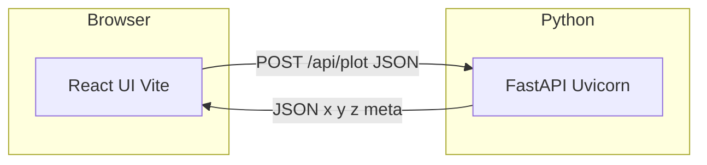
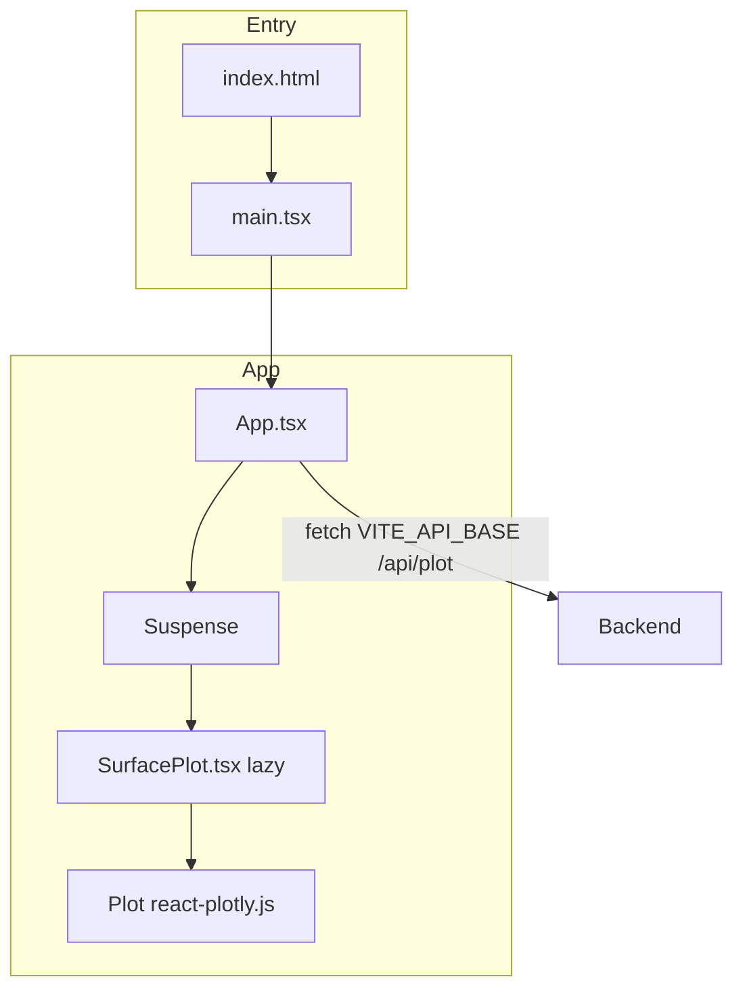
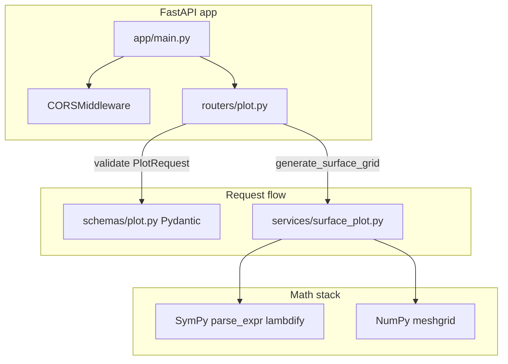
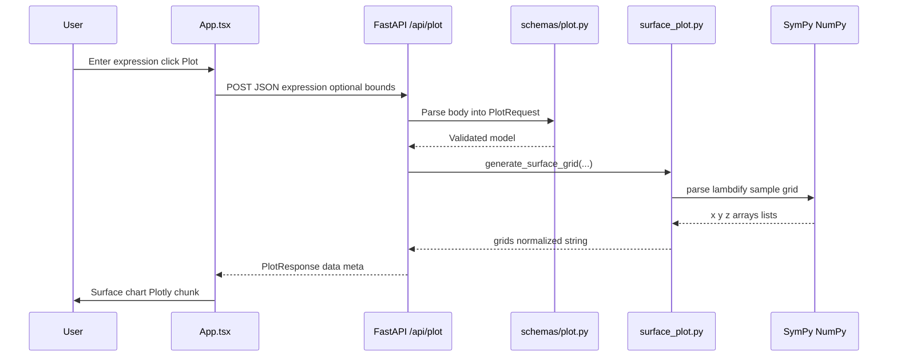

# Architecture (current)

## System context

## Frontend (Vite + React + TypeScript)

## Backend (FastAPI)

## End-to-end request path

## Notes

- Math strings are evaluated **only** on the server (`surface_plot.py`); the browser never parses user expressions as code.
- Plotly loads in a **lazy** chunk (`SurfacePlot.tsx`) after a successful API response.
- API routes are mounted under **`/api`** (`main.py`: `include_router(..., prefix="/api")`), so the plot endpoint is **`POST /api/plot`**.
